# Steps to deploy AKS to an Azure Local SFF machine via Azure Portal

*A step-by-step walkthrough for deploying AKS to an Azure Local Small form factor machine*

---

Following on from my previous post of running [Azure Local SFF on an Azure VM](./setting-up-azure-local-sff-lab-on-azure-vm.md), until you deploy a container orchestrator on the provisioned machines, you can't realistically run any workloads. To do do you have the following options:

- [Docker](https://learn.microsoft.com/en-us/azure/azure-local/small-form-factor/small-form-factor-containerized-workloads?view=azloc-2608&tabs=docker#choose-your-approach)
- [K3s](https://learn.microsoft.com/en-us/azure/azure-local/small-form-factor/small-form-factor-containerized-workloads?view=azloc-2608&tabs=k3s#choose-your-approach)
- [AKS](https://learn.microsoft.com/en-us/azure/azure-local/small-form-factor/small-form-factor-containerized-workloads?view=azloc-2608&tabs=AKS#choose-your-approach)

I want the simplest and most integrated method possible, so this article shows how to deploy AKS as it can be performed via Azure, whereas the other options (Docker, K3s) require manual installation and configuration. (*Docker is available by default, but there a number of steps that need to performed to configure it for use*)

*Note: In the current preview, AKS can only be deployed to one node. I would expect this to be expanded to multiple nodes in the future.*

## Installing AKS

You can find the official Learn docs for [Provisioning AKS on bare metal](https://learn.microsoft.com/en-us/azure/aks-hybrid-edge/bare-metal/aks-bare-metal-create-cluster-portal) to see the various options for deployment, I've just kept it simple as it's in my lab environment.

- Select the  Azure Arc management blade from the portal -> (1) `Machine provisioning (Preview)` -> (2) `Deploy Cluster` -> (3) `AKS Arc for Azure Local on Linux`

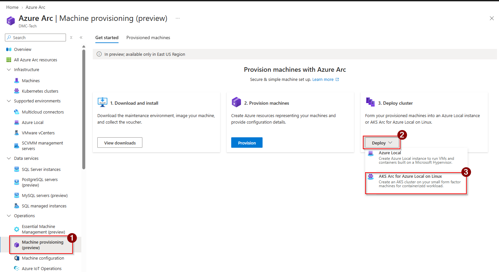

- Enter the (1) `Site` details - select the corresponding site that the provisioned machines have been added to.
- Select the (2) `Region` the cluster is to be deployed to. Keep it to the same region as the machines are deployed to.
- Enter the (3) `Kubernetes cluster name`
- Click (4) `Add machines`

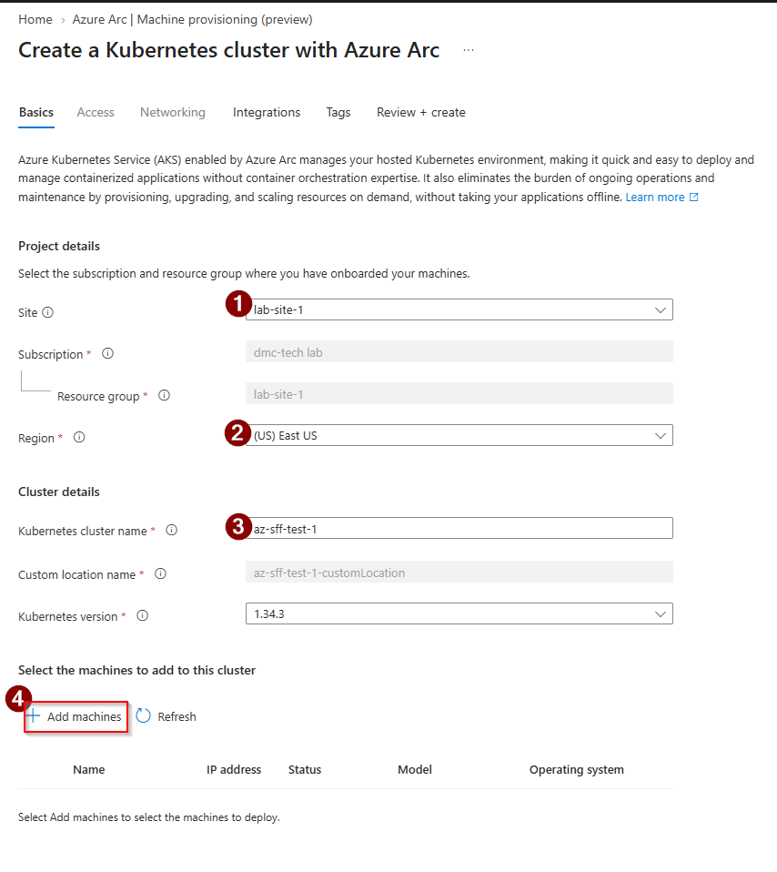

- Add the machine from the list of provisioned machines

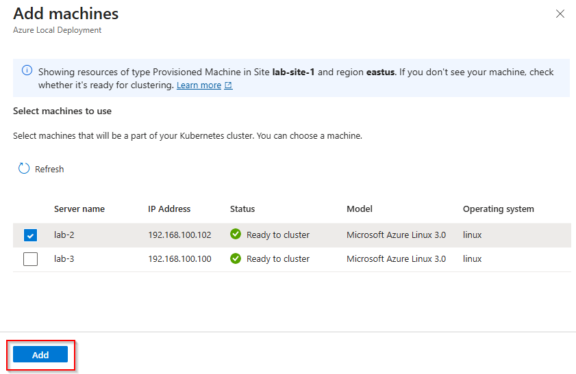

**!Note**: If you try adding more than one machine, you will be prevented in the current preview version.

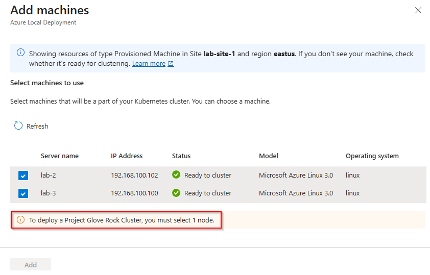

- When the machine is added, select `Access`

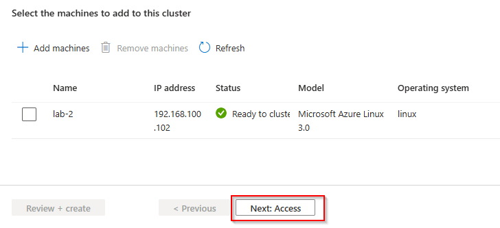

- On the Access page, select `Choose Microsoft Entra group`. Select the group you want as Kubernetes admins of the cluster.
  
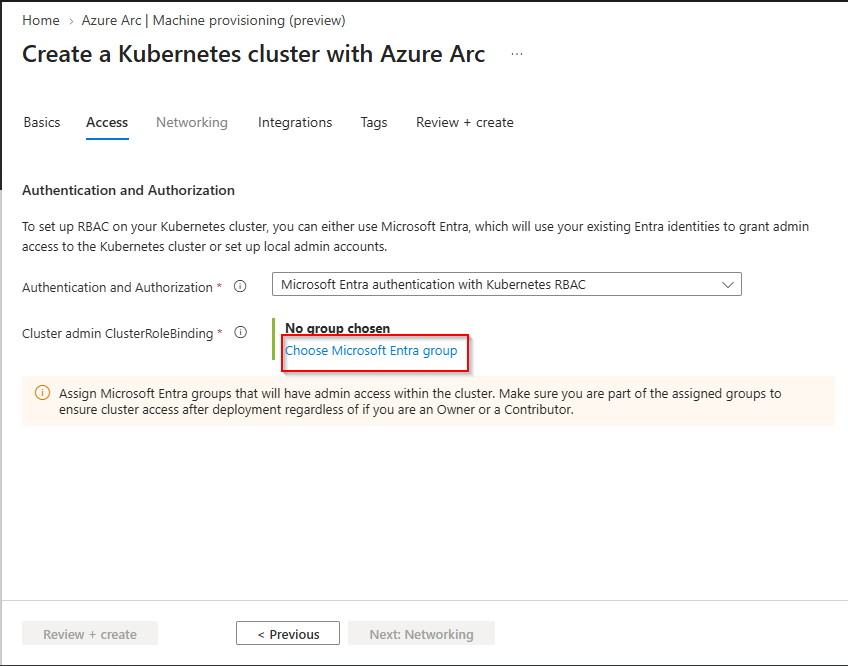

- Once the group has been chosen, validate it is correct and if happy, select `Networking`

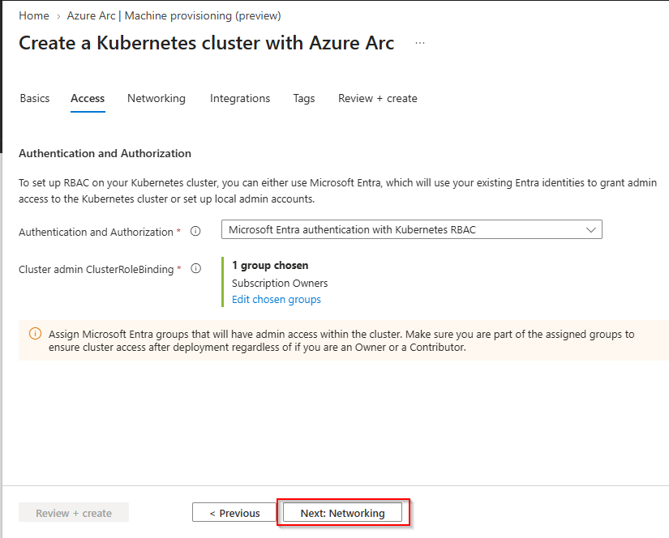

- Enter the (1) `Control plane IP address`. Ensure the address is within the subnet you've deployed the machine is in.
- When happy, select (2) `Next: Integrations`

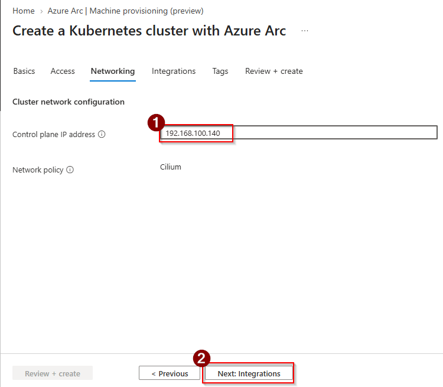

- Choose whether you want to monitor the cluster or not. Select Log Analytice Workspace as appropriate. Select `Next: Tags` when ready.

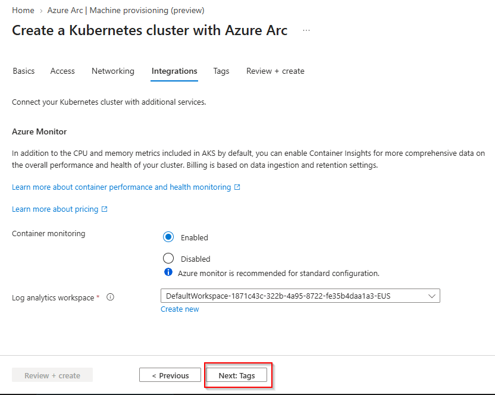

- Enter Tags if you want and click on `Next: Review + create`
- Validate the details on the Review page, and if happy, Click on `Create`
  
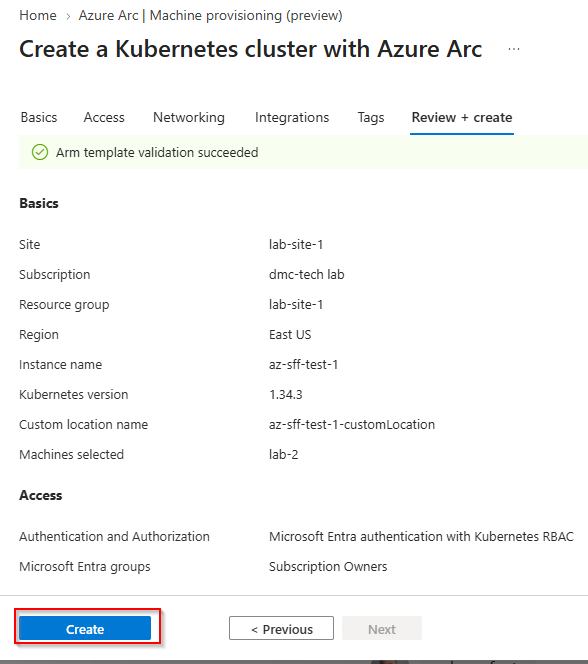

The deployment is now submitted and you can track the progress

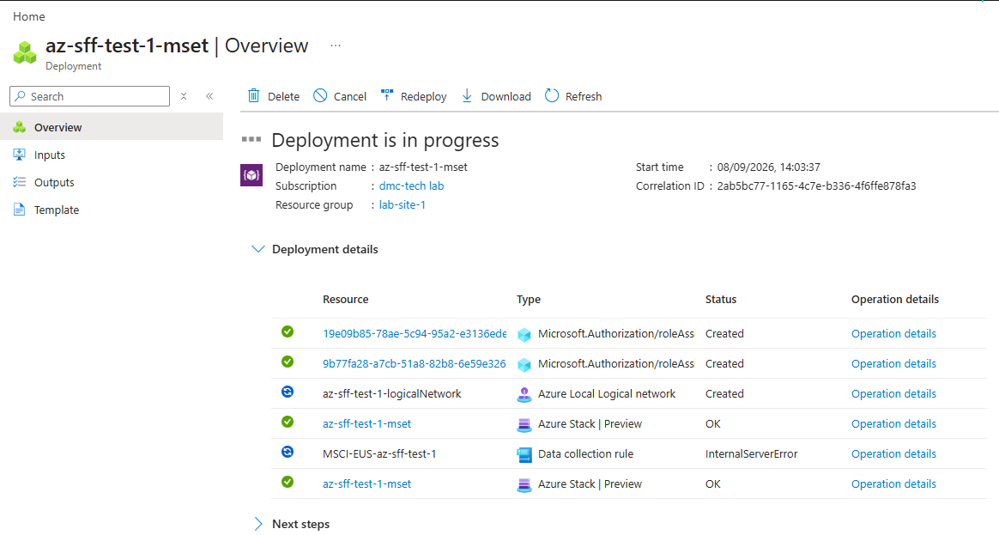

Successful deployment:

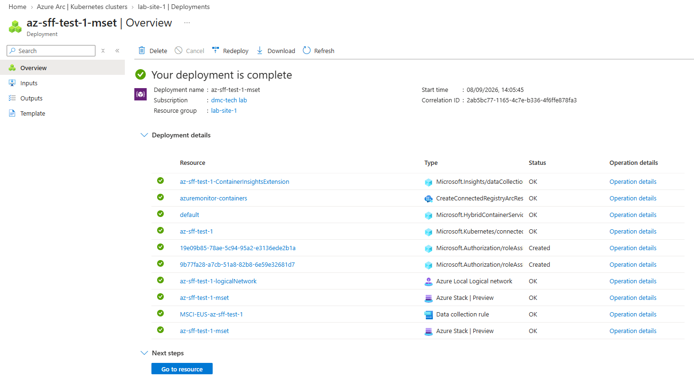

## Validate Kubernetes cluster status

Hopefully your cluster has been successfully deployed. If so, you can check by using the Azure portal to view the cluster resources, namespaces and workloads that are implemented and running.

To check, Open the Azure Arc blade from the Azure portal, select `Kubernetes clusters` and select the cluster you've just deployed

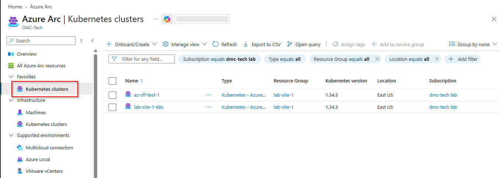

On the home screen, hopefully the status shows as `Connected`.

Check the (1) `Namespaces` and (2) `Workoads` statuses. They should show as green checks for each item.

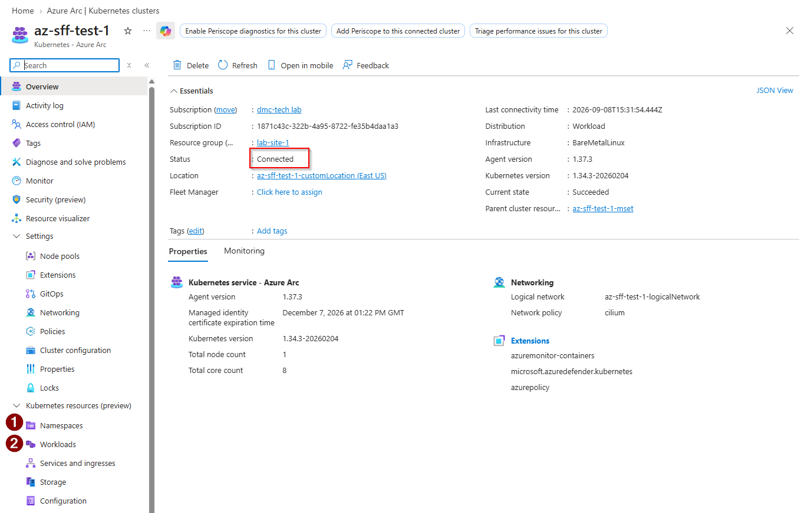

### Namespaces status

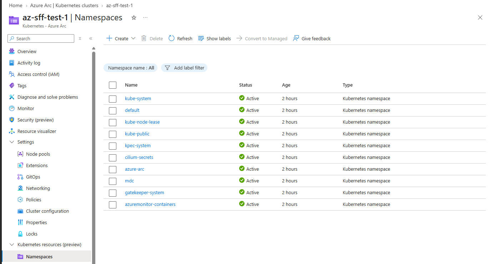

### Wokloads status

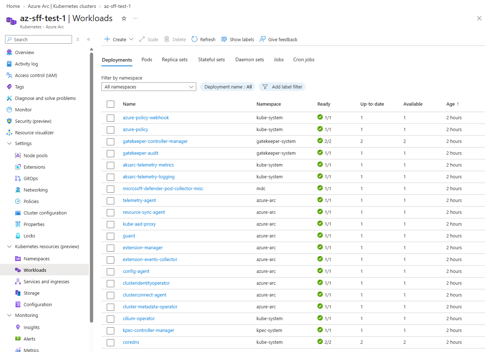

## Managing the cluster via `kubectl`

Here's the instructions for connecting directly to your K8s cluster via kubectl and how to retrieve the kubeconf file via Azure Arc. This is handy if you are on the same network as the cluster and don't want to authenticate to Azure to gain access. 

[Retrieve Azure Arc Kubernetes cluster kubeconfig](https://learn.microsoft.com/en-us/azure/aks-hybrid-edge/local/hyperconverged/retrieve-admin-kubeconfig#retrieve-the-certificate-based-admin-kubeconfig-using-az-cli)

If you are on a remote network to the K8s cluster, you can proxy to the cluster via Azure Arc:

[Connect via proxy](https://learn.microsoft.com/en-us/azure/aks-hybrid-edge/local/hyperconverged/azure-rbac-local?tabs=cli%2Cazurecli#access-your-cluster-from-a-client-device-proxy-mode)

