# Setting Up a Lab to Deploy Azure Local SFF on an Azure VM

*A step-by-step walkthrough for running a three-node Azure Local Small Form Factor cluster in the cloud—using nested Hyper-V on a single Azure VM.*

---

I wanted to get hands-on with **Azure Local** (the small form factor / SFF offering) without having physical hardware. Azure Local SFF uses zero-touch provisioning (ZTP), so I needed an environment that could simulate that: nested VMs on an Azure host, booting from the official installer ISO and getting IPs via DHCP, just like real devices would.

This post walks through how I set up that lab—from Terraform and remote state, through first boot and voucher retrieval. The repository also includes a **Bicep** alternative that models the same Azure resources; see [**`DEPLOYMENT.md`**](https://github.com/dmc-tech/azure-azlocSFF-lab/blob/main/DEPLOYMENT.md) if you prefer `az deployment` over Terraform.

---

## What You’re Building

By the end you’ll have:

- **One big Azure VM** (Windows Server 2025, 32 vCPUs, 256 GB RAM) with nested virtualization, no public IP, and access via **Azure Bastion**.
- **Three nested Hyper-V VMs** that boot from the Azure Local SFF installer ISO, get IPs from a built-in DHCP scope, and are ready for ZTP/voucher collection.
- **Automation** that: provisions the infra with Terraform (or Bicep per the repo’s `DEPLOYMENT.md`), configures the host with a setup script on first boot, and gives you a script to pull FDO vouchers from the nodes.

If you’re new to Azure Local Small Form Factor or ZTP, this is a great way to see the full flow without touching hardware.

---

## Get the repo

The lab is in this GitHub repo: **[azure-azlocSFF-lab](https://github.com/dmc-tech/azure-azlocSFF-lab)**.

Clone it so you have the Terraform (or Bicep) config and scripts locally (use a folder you’re happy running commands from):

**HTTPS:**

```bash
git clone https://github.com/dmc-tech/azure-azlocSFF-lab.git
cd azure-azlocSFF-lab
```

**SSH (if you use SSH keys with GitHub):**

```bash
git clone git@github.com:dmc-tech/azure-azlocSFF-lab.git
cd azure-azlocSFF-lab
```

All the steps below assume you’re running commands from the repo root (or from the `bootstrap` folder when we say so).

---

## Prerequisites

Before starting, make sure you have:

- **Terraform** (1.0 or newer) installed — [install Terraform](#installing-terraform-and-azure-cli).
- **Azure CLI** installed and logged in (`az login`) with the subscription you want to use — [install Azure CLI](#installing-terraform-and-azure-cli).
- Enough **quota** in your chosen region for a `Standard_E32s_v5` VM and Azure Bastion (check in the Azure Portal if you’re not sure).

---

## Step 1 — Bootstrap Terraform State (One-Time)

I prefer keeping Terraform state in Azure Storage so it’s durable and shareable. The repo includes a small **bootstrap** module that creates the storage account and container. You only do this once per environment.

**1.1** Open a terminal and go into the `bootstrap` folder of the repo.

**1.2** Copy the example variables file and edit it with your preferred region and names:

```bash
copy terraform.tfvars.example terraform.tfvars
```

*(On macOS/Linux use `cp` instead of `copy`.)*

Edit `terraform.tfvars` and set things like `resource_group_name`, `location`, `storage_account_name_prefix`, `container_name`, and `state_file_key` to whatever fits your naming convention.

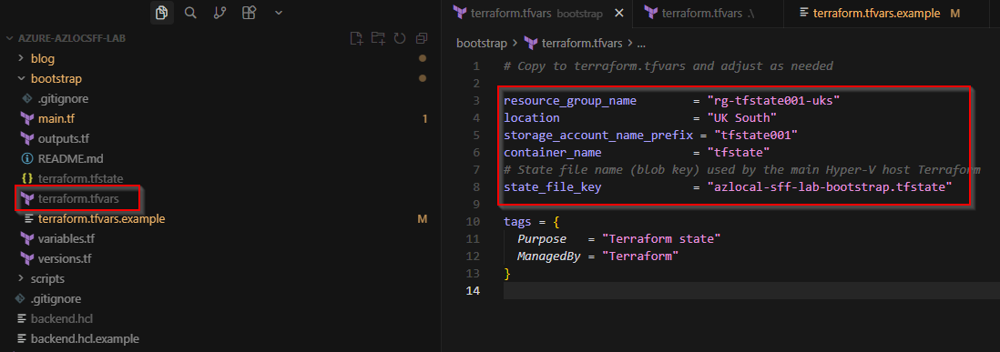

**1.3** Initialise and apply the bootstrap:

```bash
terraform init
terraform plan
terraform apply
```

**1.4** Note the outputs: `storage_account_name`, `resource_group_name`, `container_name`, and the state file key. You’ll need these for the main Terraform backend.

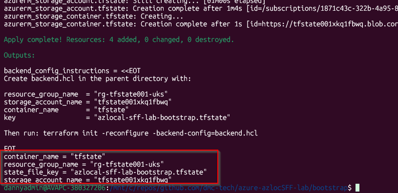

---

## Step 2 — Configure the Main Terraform Backend

**2.1** In the **root** of the repo (not inside `bootstrap`), copy the backend example and create your real backend config:

```bash
copy backend.hcl.example backend.hcl
```

**2.2** Open `backend.hcl` and fill in the values from the bootstrap outputs:

- `resource_group_name` — the resource group where the state storage account lives  
- `storage_account_name` — from bootstrap output  
- `container_name` — from bootstrap output  
- `key` — e.g. `azlocal-sff-lab-bootstrap.tfstate` (must match what you use in bootstrap if you parameterised it)

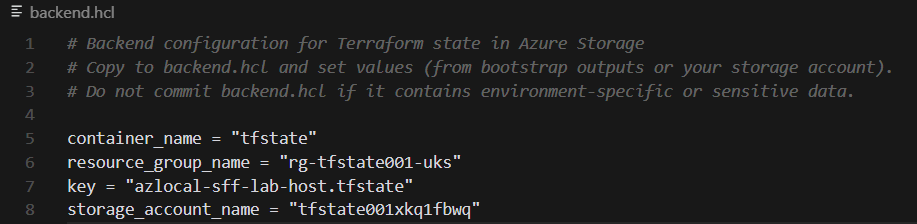

**2.3** Initialise the main Terraform with that backend:

```bash
terraform init -reconfigure -backend-config=backend.hcl
```

You should see Terraform successfully initialising the Azure backend. Don’t commit `backend.hcl` if it has environment-specific or sensitive names.

---

## Step 3 — Set Your Main Variables and Deploy

**3.1** Copy the example tfvars and create your own:

```bash
copy terraform.tfvars.example terraform.tfvars
```

**3.2** Edit `terraform.tfvars`. The important one is **`admin_password`**: it must meet Azure’s Windows VM password rules (length and complexity). Set a strong password and keep it safe—you’ll use it to sign in via Bastion.

You can also tweak:

- `resource_group_name`, `location`, `environment`  
- `vm_name` (max 15 characters—Windows computer name limit)  
- `data_disk_size_gb` (default is 1024 for 1 TB)  
- `tags`

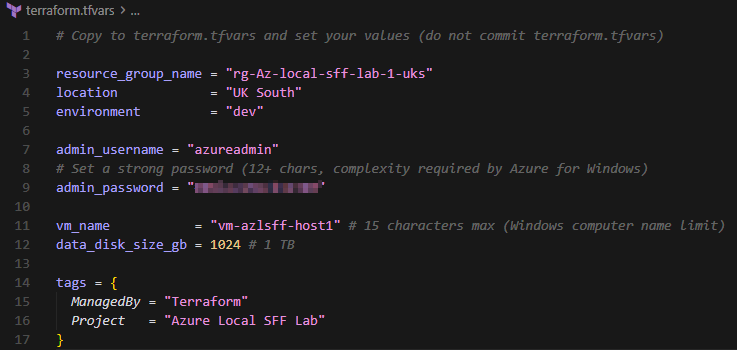

**3.3** Run a plan to see what will be created:

```bash
terraform plan
```

You should see the resource group, vnet, subnets, NAT gateway, Bastion, Windows VM, data disk, storage account for scripts, and the VM extension. If anything looks off, adjust variables and plan again.

**3.4** Apply:

```bash
terraform apply
```

Confirm when prompted. The apply will take several minutes: it creates all the Azure resources, installs the Hyper-V and DHCP roles on the VM, copies the setup and voucher scripts to the VM, configures auto-logon and RunOnce, and reboots the VM.

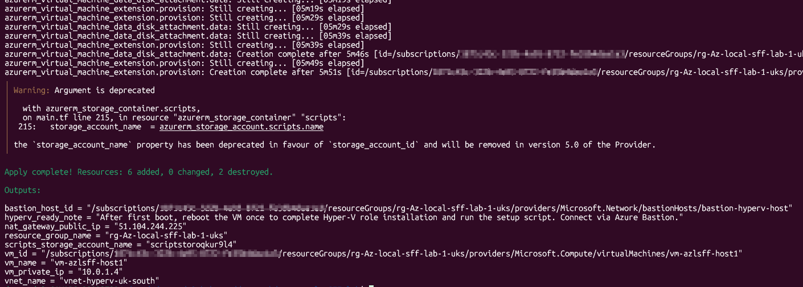

---

## Step 4 — Wait for First Boot and setup.ps1

After the reboot, the VM comes up, auto-logs on once, and runs **setup.ps1** automatically. That script:

1. Brings the 1 TB data disk online, formats it, and assigns `F:\`
2. Creates folders under `F:\Hyper-V` for VMs, VHDs, and images
3. Downloads the Azure Local installer ISO from `aka.ms/ztp/installeros`
4. Creates an internal Hyper-V switch with NAT (`192.168.100.0/24`) and configures DHCP for the nested VMs
5. Creates three nested VMs (NestedVM-01, 02, 03) with 8 vCPUs and 16 GB RAM each, vTPM enabled
6. Attaches the ISO to each VM and boots them with DVD-first

Give it **15–30 minutes** depending on download speed. The script is idempotent and writes a completion flag, so it won’t re-run on later logons. Logs go to `C:\Scripts\setup.log`.

---

## Step 5 — Connect via Azure Bastion

**5.1** In the Azure Portal, open your resource group and select the Windows VM.

**5.2** Click **Connect** and choose **Bastion**.

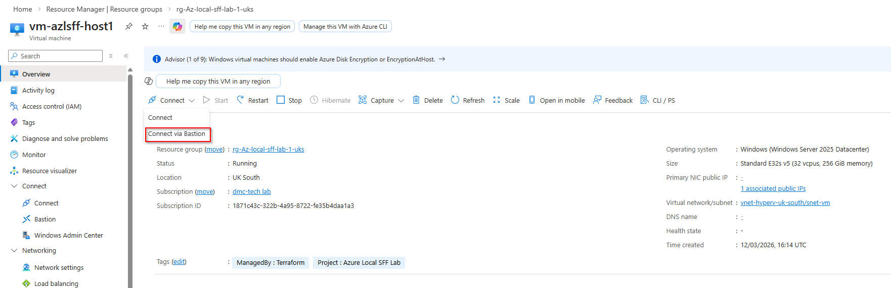

**5.3** Enter the username and password from your `terraform.tfvars` and sign in. You’ll get an RDP session in the browser—no public IP on the VM, which keeps things locked down.

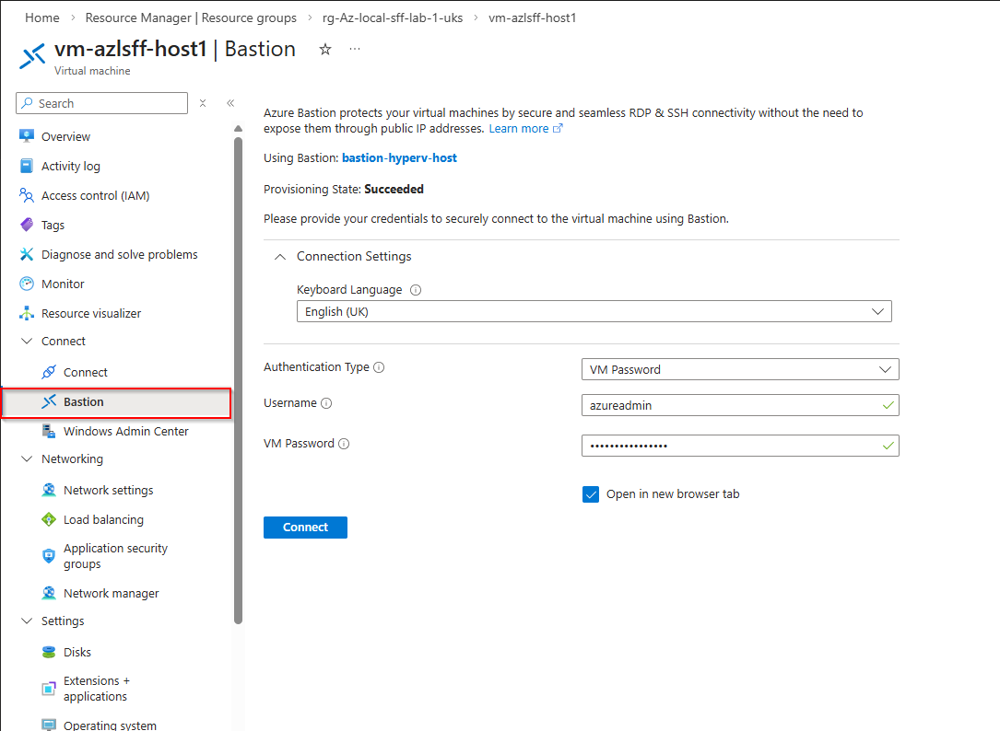

If you connect when the machine is still provisioning, You should see a PowerShell window with **setup.ps1** running (and optionally the setup log). Once you’re in, you can leave the session open or disconnect; the script keeps running (as long as you don't close the PowerShell console!).

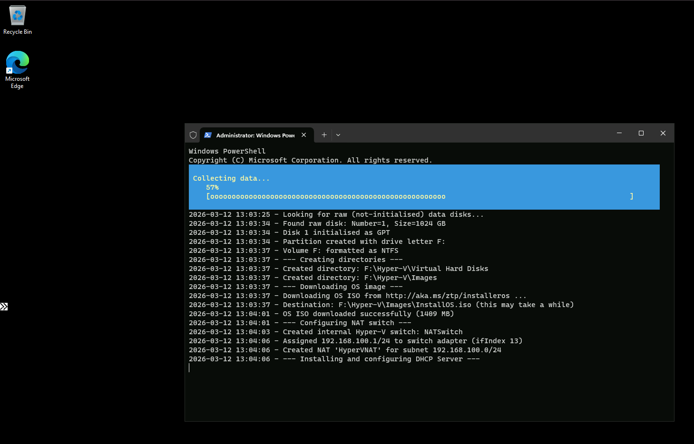

**5.4** Once you’re in, you can open **Hyper-V Manager** and confirm the three nested VMs are present and running. They should be booting (or already booted) from the Azure Local installer ISO.

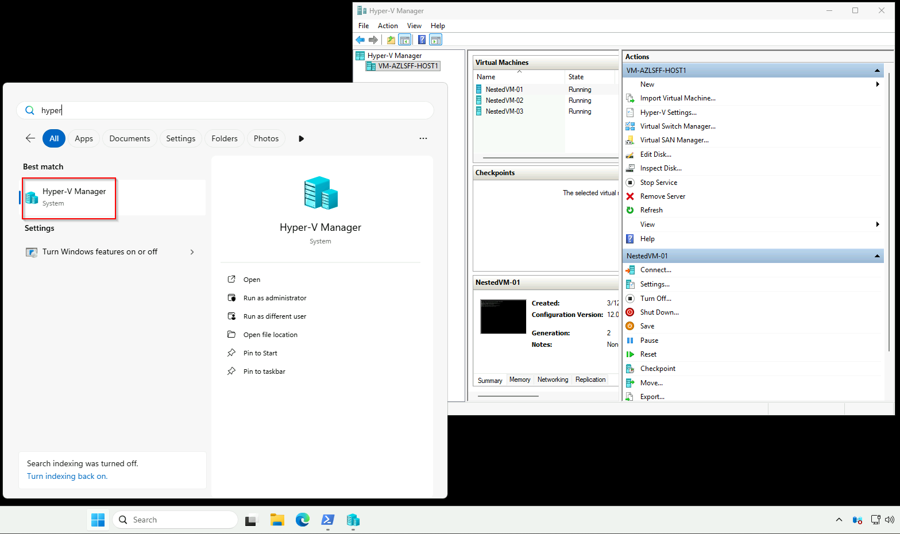

If you open the console for one of the nodes, youshould hopefully see that the ROE (Restricted Operating Environment) has been successfully provisioned:

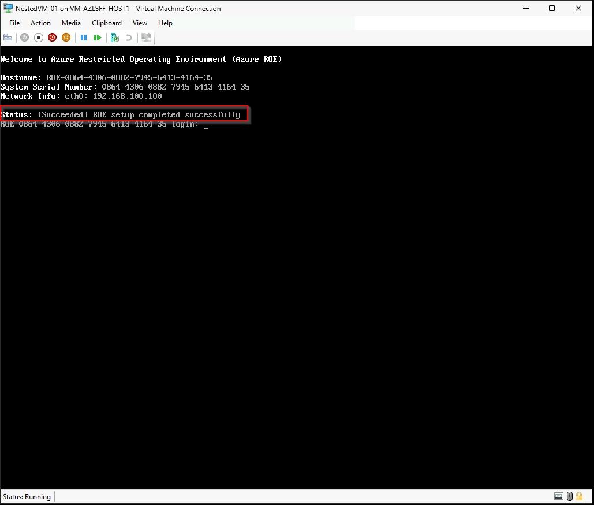

---

## Step 6 — Retrieve FDO Vouchers from the Nested Nodes

Azure Local SFF uses FDO (FIDO Device Onboarding) vouchers for zero-touch provisioning. The repo includes **Get-SffNodeVoucher.ps1**, which discovers the nested VMs (via the DHCP scope or explicit IPs), connects over SSH, and pulls the PEM voucher files to the host.

From PowerShell, run:

```powershell
C:\Scripts\Get-SffNodeVoucher.ps1
```

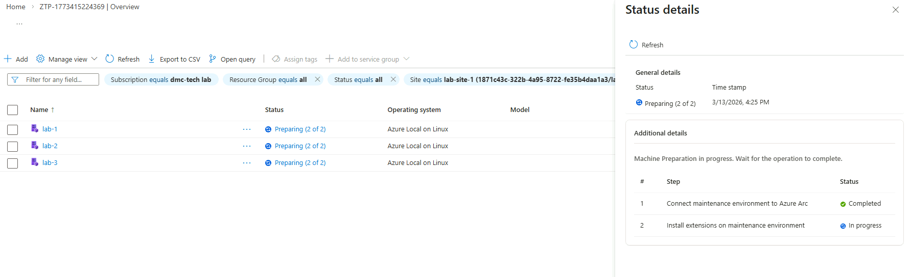

Vouchers are saved under `C:\vouchers\<ip>\` on the host.

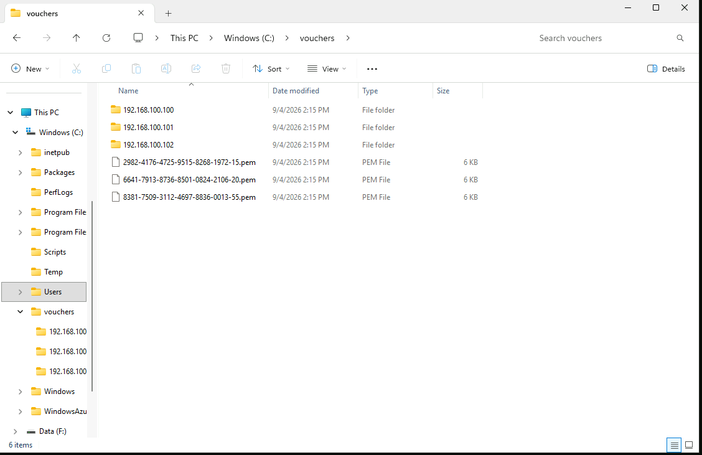

---

## Step 7 — Register Vouchers in Azure to Provision the Nodes

With the FDO voucher PEM files on the host, the next step is to register them in Azure so the nodes are provisioned and managed as Azure Local devices.

In the **Azure Portal**, go to **Azure Arc** (search for “Arc” or “Azure Arc” in the top search bar). In the left menu, under **Operations**, open **Machine provisioning (preview)**. Select **Provision** under 2. Provision machines.

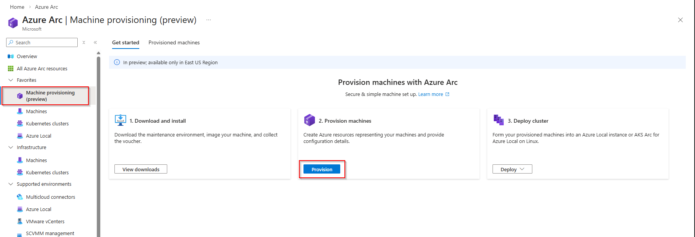

A site needs to be created to associate the nodes to. Click on `Create new (1)` and then enter a `Name (2)` and `Resource group (3)` name in the new form that appears. Click `Create (4)` to generate the site.

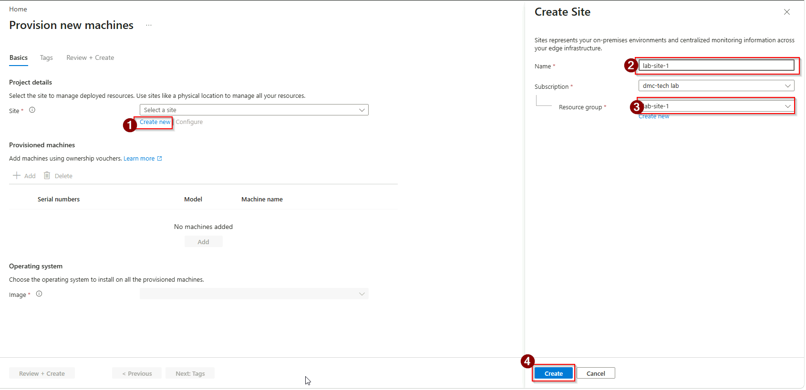

Once the site has been created, it needs to be configured to use Azure Arc Gateway.
The region for the site for the Public preview must be set to one of the following:

- eastus
- eastus2
- eastus2euap
- centralusueap

Click on `Configure (1)` to open the config blade.
Enter the `Custom Manager Resource Group Name (2)`, Set the `Preferred DNS(3)`, Ensure `Use Azure Arc gateway (4)` switch is set to use and then click on `Crate new (5)` Azure Arc Gateway.

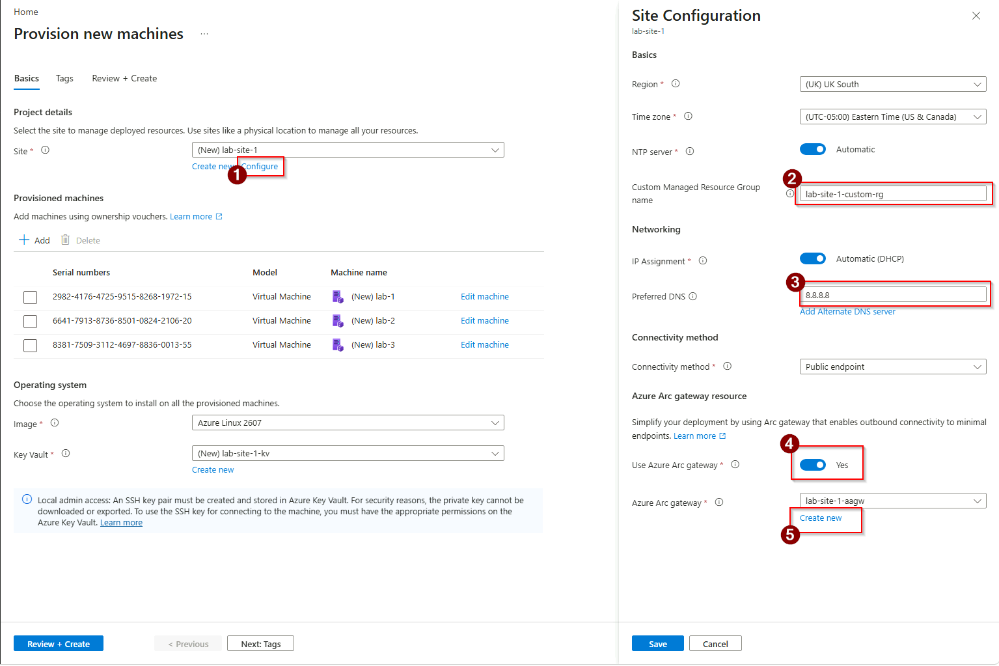

Enter the name of the Azure Arc gateway (1) and click on `OK (2)` to create.

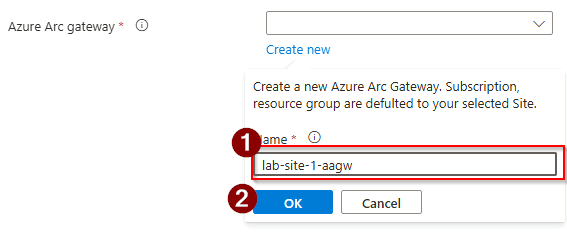

When the gateway is created, click on `Save`

Next, click on `Add (1)` in the Provisioned machines section. Click on `Browse (2)` and add the voucher files from `C:\vouchers\<voucher>.pem` then `Add (3)`.

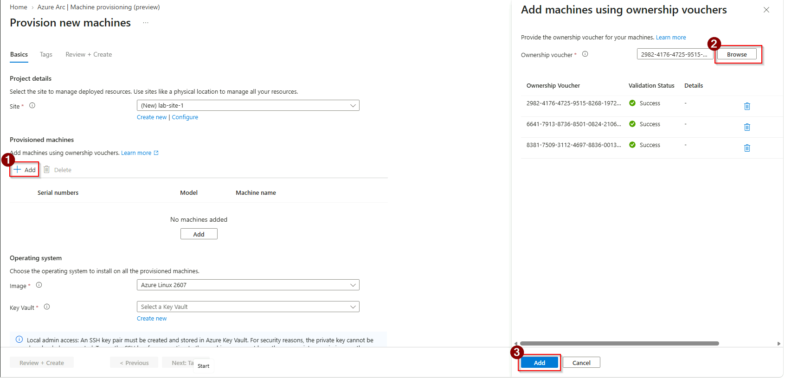

Start the flow to **provision a new device** or **register a device** (wording may vary—look for “Add device”, “Provision device”, or “Register with voucher”). Choose the option that accepts an **FDO voucher** or **upload voucher file**.

For each node, upload the corresponding PEM file from `C:\vouchers\<voucher>.pem` on the Hyper-V host (you can copy the files to your local machine or use Bastion and the portal from the same browser). Once uploaded, you can then change the name of the machine to make it more readable.

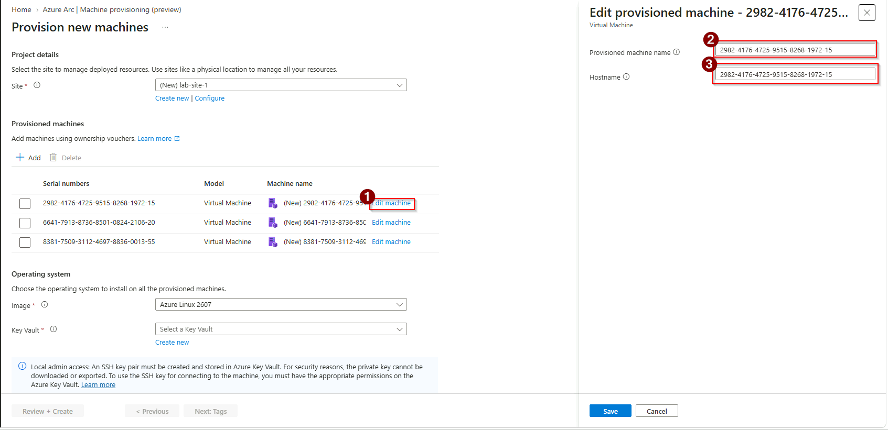

An SSH key pair must be created and stored in an Azure Key Vault. This can be provisioned by clicking `Create new`.

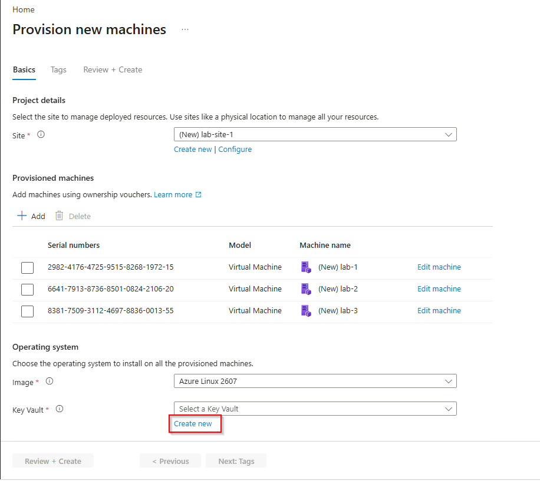

Enter the `Key vault name (1)`, `Region (2)` name, and `Pricing tier (3)` as Standard, then click `Next (4)`

Ensure all the Resource access options are selected and click `Review + create (1)`

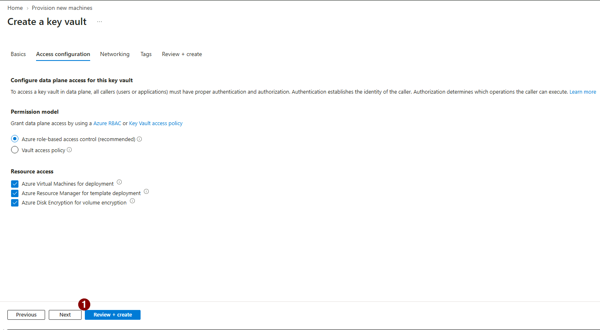

Once you're happy with the changes, click on 'Create (1)' to provision the key vault.

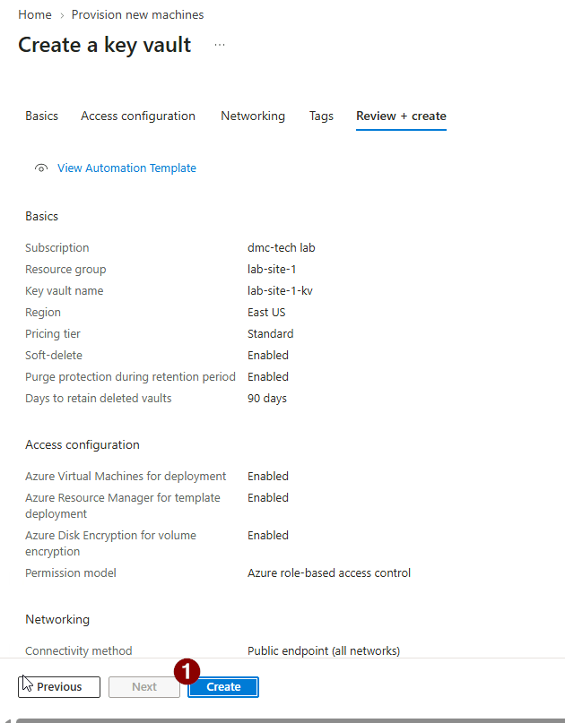

Once the key vault is provisioned and you're happy with the changes, click on 'Review + Create' and then start the provisioning process.

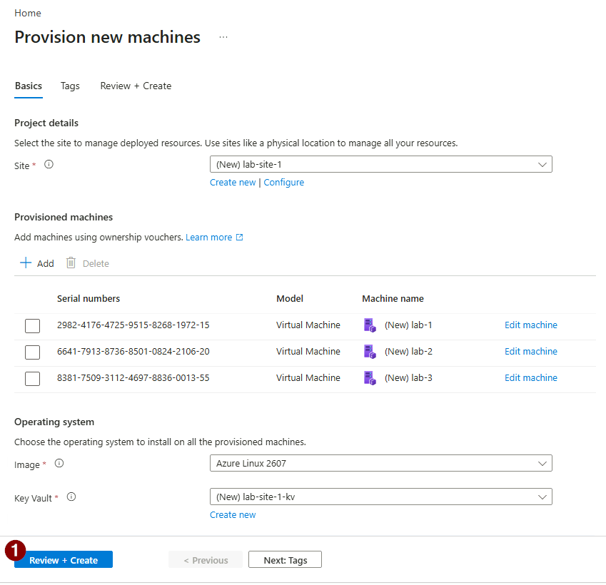

You can see the various ARM resources are created in the deployment process. Once complete, `View Provisioned Machines`.


After registration, Azure will provision the devices. You can track status in the **Azure Arc   -> Machines provisioning (Preview) -> Provisioned machines** view. We can see the step progress by selecting the `status` link for the node.

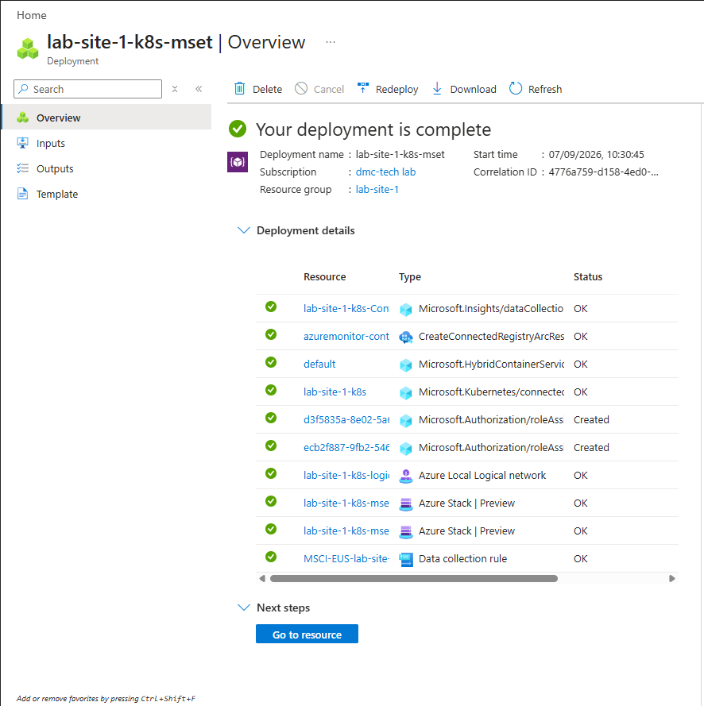

Once provisioning completes, the nodes appear as `Ready to Cluster`.

From there, follow the documentation as described on the  for the scenario you want to test.


---

## Step 8 — Cost and Shutdown

The lab uses a **Standard_E32s_v5** VM, so it’s not cheap if left on 24/7. The Terraform config includes an **auto-shutdown schedule** at 19:00 GMT every day. You can change or disable it in the Terraform if you prefer. When you’re done testing, either rely on that or run:

```bash
terraform destroy
```

(And optionally tear down the bootstrap state storage if you don’t need it anymore.)

---

## Quick Reference

| What | Where |
|------|--------|
| Setup script log | `C:\Scripts\setup.log` |
| Setup / voucher scripts | `C:\Scripts\setup.ps1`, `C:\Scripts\Get-SffNodeVoucher.ps1` |
| Nested VM storage | `F:\Hyper-V` |
| Vouchers (default) | `C:\vouchers\<ip>\` |
| Nested network | `192.168.100.0/24`, DHCP 192.168.100.100–200 |

---


## Installing Terraform and Azure CLI

If you don’t have Terraform or Azure CLI yet, here’s how to get them. Official install docs are linked below if you need more detail or a different OS.

### Terraform

- **Official install guide:** [Install Terraform | HashiCorp Developer](https://developer.hashicorp.com/terraform/install)

**Windows (PowerShell):**

- **Option A — winget:**  
  `winget install Hashicorp.Terraform`
- **Option B — Chocolatey:**  
  `choco install terraform`
- **Option C — Manual:** Download the Windows AMD64 zip from [terraform.io/downloads](https://www.terraform.io/downloads), extract it, and add the folder to your `PATH`.

**macOS:**

- **Homebrew:**  
  `brew tap hashicorp/tap` then `brew install hashicorp/tap/terraform`

**Linux:**

- **Using apt (Debian/Ubuntu):** See the [HashiCorp Linux install instructions](https://developer.hashicorp.com/terraform/install?product_intent=terraform); they provide a repo and package name.
- **Manual:** Download the right zip from [terraform.io/downloads](https://www.terraform.io/downloads), extract, and add the binary to your `PATH`.

Check the install with:

```bash
terraform version
```

You want 1.0 or newer.

### Azure CLI

- **Official install guide:** [Install Azure CLI | Microsoft Learn](https://learn.microsoft.com/en-us/cli/azure/install-azure-cli)

**Windows:**

- **Option A — MSI installer:** Download and run the installer from the [Azure CLI install page](https://learn.microsoft.com/en-us/cli/azure/install-azure-cli-windows).
- **Option B — winget:**  
  `winget install Microsoft.AzureCLI`

**macOS:**

- **Homebrew:**  
  `brew update && brew install azure-cli`

**Linux:**

- **One-line install (most distros):**  
  `curl -sL https://aka.ms/InstallAzureCLIDeb | sudo bash`  
  (See the [Microsoft docs](https://learn.microsoft.com/en-us/cli/azure/install-azure-cli-linux) for other package managers.)

Check the install and sign in:

```bash
az version
az login
```

After `az login`, pick your subscription if you have more than one:

```bash
az account set --subscription "Your Subscription Name or ID"
```

---

That’s it. You’ve got a repeatable lab for Azure Local SFF on an Azure VM: Terraform for infra, a single Windows host with nested Hyper-V, and scripts to get from zero to three nodes ready for ZTP. Add your screenshots to the `blog/images` folder (see the filenames in the Markdown) and you’re set for a clear, visual post on your Squarespace site. If you hit snags—especially around quota, Bastion, or the first run of setup.ps1—check the repo’s main README and the script logs; they’ve got the details.

Happy labbing.
